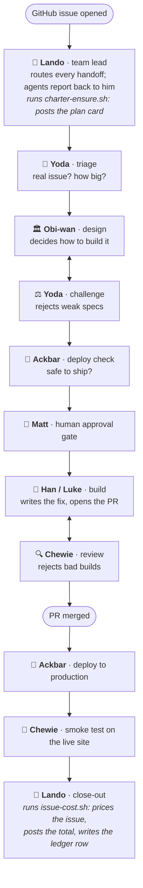

# Per-issue cost tracking for an AI dev team

*Origin take-home assessment, Matt Voget*

I run a team of eight AI coding agents (the "Falcon Dev Team") that works
GitHub issues end to end: triage, design, build, review, deploy. It runs on
[Kyber](docs/kyber-explainer.md), a platform I built for hosting long-running
AI agents. The team ships real software and spends real money on one shared
API account. Before this project I could not answer the most basic question
about it: **what does an issue cost?**

## How the team works an issue

Lando (the team lead) receives every GitHub event and routes each handoff.
Double arrows mark where work gets sent back.

Cost tracking rides the whole path: **every agent runs
[`token-usage.sh`](docs/mirror/token-usage.sh) twice per stage**, once at
pickup (an odometer reading of its session) and once at completion (posting
what its stage used and on which model). Those reports are what Lando adds up
at the end with [`issue-cost.sh`](docs/mirror/issue-cost.sh).

## An Experiment in Model Cost versus Quality

Baseline: all eight agents on the premium model (claude-opus-5), 4 live
issues. Test arm: premium model kept only at the two judgment points
(the design stage and the code-review gate), the cheaper claude-sonnet-5
everywhere else, 3 live issues. I wrote the predictions down in this repo
before the test arm ran.

| | Before (all premium model) | Prediction (written first) | Result |
|---|---|---|---|
| **Cost per issue** | $33.86 median | $21 to $24 | **$22.63, down 33%** |
| **Work volume** | 46M tokens median | unchanged, within 15% | 44M on comparable issues: unchanged |
| **Quality** | 6.9% of issue cost was redone work | stays flat | **18.3% redone, on all 3 test issues** |
| **Net** | | savings win if quality holds | Savings of about $11 per issue bought about $2.10 of added rework: 5 to 1 in favor, in this sample |

Three checks agree on the cost result:

- Medians: down 33%.
- Like-for-like small bugs: down 29%.
- Repricing each test issue's actual work at premium prices: down 34%, 34%,
  and 35%, right on the arithmetic. The savings came from where the models
  were placed, not from the agents behaving differently.

The quality row is the finding I care most about. The rework didn't just
grow, it **moved**. In the baseline, redone work happened in the cheap early
stages. In the test arm, it was the premium reviewer rejecting work the
cheaper builder produced, sending it back through the two most expensive
stages. The review gate did its job, and that is exactly the tax cheaper
models pay.

So the conclusion is two-sided on purpose: **a third cheaper, with a
measured and rising rework tax.** Not "cheaper models are free." Still
unmeasured at this sample size: bugs that slip past the reviewer entirely,
time lost to review loops, and whether rework grows with issue size. The
biggest test issue had the worst rework share (30% of its cost), which is
the first thing a follow-up should check.

This project makes the team account for its own spending:

1. **A plan card per issue.** When work starts, the team lead agent (Lando)
   posts a card to the issue's Discord thread: what's in scope, which agents
   are involved, and which AI model each one runs.
2. **Each agent reports its own numbers.** At the end of its part of the
   work, each agent measures what it used (by reading its own session log, via [`token-usage.sh`](docs/mirror/token-usage.sh)),
   posts a one-line summary to Discord, and attaches the detailed numbers to
   the GitHub issue in a form software can read back later.
3. **A price tag on close.** When the issue is done, Lando adds up every
   agent's numbers and converts them to dollars using published model prices
   (via [`issue-cost.sh`](docs/mirror/issue-cost.sh)),
   posts the total to Discord, and appends a row to a running ledger file
   ([snapshot](docs/mirror/cost-ledger-snapshot.jsonl)) so issues can be compared.
4. **A platform fix.** Building this exposed that Kyber's own usage metrics
   dropped "output" tokens entirely and priced cache writes at $0. I fixed it
   in [kyber#23](https://github.com/matty-v/kyber/pull/23) (released as
   [v1.0.1](https://github.com/matty-v/kyber/releases/tag/v1.0.1)). It mattered here twice: the fix is why cache-write prices exist
   in the price table the ledger uses (about 12% of every issue's bill), and
   it turned the platform's dashboard into a usable second opinion on the
   agents' self-reports. The token counts themselves never depended on it.
5. **An experiment.** Change the underlying models by role and measure the
   effect on both cost and quality. Full results above, details in
   [docs/experiments/cost-per-issue.md](docs/experiments/cost-per-issue.md).

## Where the changes live

| Piece | Repo | Link |
|---|---|---|
| Platform fix: output tokens + cache-write pricing | `matty-v/kyber` | [kyber#23](https://github.com/matty-v/kyber/pull/23) (merged) |
| Agent self-reporting, team charter changes, price table | `matty-v/falcon-dev-common` | merged as fdc#118; private repo, all changes mirrored in [`docs/mirror/`](docs/mirror/README.md) |
| Lando: plan card, cost roll-up, ledger | `matty-v/lando-agent` | merged as lando-agent#105; private repo, mirrored in [`docs/mirror/`](docs/mirror/README.md) |
| Experiment write-up | this repo | [`docs/experiments/cost-per-issue.md`](docs/experiments/cost-per-issue.md) |
| Process log (every prompt, pushback, and AI mistake) | this repo | [`PROCESS.md`](PROCESS.md) |

## How I used AI, and what worked

Claude Code ran the whole build:

- Research agents mapped two codebases in parallel before any plan was made.
- Design agents produced detailed plans, which I approved with changes.
- One agent built the platform fix while the main session built the team
  changes.
- Three independent AI reviewers attacked the work before merge and produced
  22 confirmed findings, including a redesign of code I had already approved.
- Live monitors watched the agent team work real issues and flagged failures
  as they happened.

The pattern that worked: the AI proposes with arithmetic, I redirect with
judgment. Every instance is in [PROCESS.md](PROCESS.md). The single most
repeated lesson: anything that must happen reliably belongs in a tested
script, not in written instructions (example: [`charter-ensure.sh`](docs/mirror/charter-ensure.sh),
which replaced instructions the agents skipped twice). The agents ran script commands 8 out of
8 times; they skipped written procedures twice.

## Where the AI got things wrong

The full list is in [PROCESS.md](PROCESS.md) ("Trial and error" section). Highlights:

- Its first design for counting output tokens could miss work, double-count
  after gaps, and mistake new work for old. Its own reviewers caught all
  three; it was redesigned.
- Its cost scripts shipped with an outdated price table (caught in review, [patch](docs/mirror/falcon-dev-common-review-fixes.patch)) that would have
  silently cut every cost figure roughly in half.
- It passed large data the wrong way and hit an operating-system limit in
  production ([fix](docs/mirror/fdc-123.patch)). One of my own agents diagnosed that bug from inside its pod.
- A cleanup job crashed silently for hours because its error messages went
  where nobody looked ([the job](docs/mirror/ledger-reconciler.sh) now reports where its caller reads).
- It once declared Discord broken based on a missing bookkeeping note, when
  the Discord thread existed all along. I corrected it by looking.

Every failure was caught: by tests the AI wrote, by reviewers the AI ran, by
the agent team itself, or by me. And by design, every failure showed up as an
honest "unavailable" or "partial" in the records, never as a made-up number.

## Known limitations and rough edges

- **Small sample.** 4 baseline issues, 3 test issues. Medians and
  per-issue comparisons, not statistics. Two test issues also ran in
  fast-track mode (skipping my approval gates); the cleanest test issue did
  not, and it matched the results.
- **Some readings have gaps.** Agents sometimes restart mid-task, and 4 of
  30 work segments lost their "starting odometer reading." Those issues
  report a known-minimum cost instead of a total. The fix is designed but was
  held back by the code freeze during the experiment.
- **Lando's own cost is not counted.** The team lead never assigns work to
  itself, so its always-on background spending never lands on any issue.
- **The platform second-opinion check rarely ran.** The fix made it
  possible, but the close-out step that runs it kept getting skipped, and the
  fallback that writes the ledger doesn't do the comparison.
- **The plan cards list outdated models.** The team's model roster file
  wasn't updated when I upgraded the fleet. Every report flags the difference
  between planned and actual instead of hiding it.

## What I'd do with more time

- Run the second designed experiment: shrink the 140KB of team documentation
  every agent re-reads, prediction already registered
  ([details](docs/experiments/cost-per-issue.md), 8–12% savings).
- Give partial rows a proper minimum-cost figure instead of a footnote.
- Fix the mid-task restart gap so readings stop getting lost.
- Chase the next two levers the data points at: the number of API calls per
  stage, and how deep code review needs to be.
- Teach Kyber itself to attribute cost per issue, so the platform and the
  team agree on one number.
