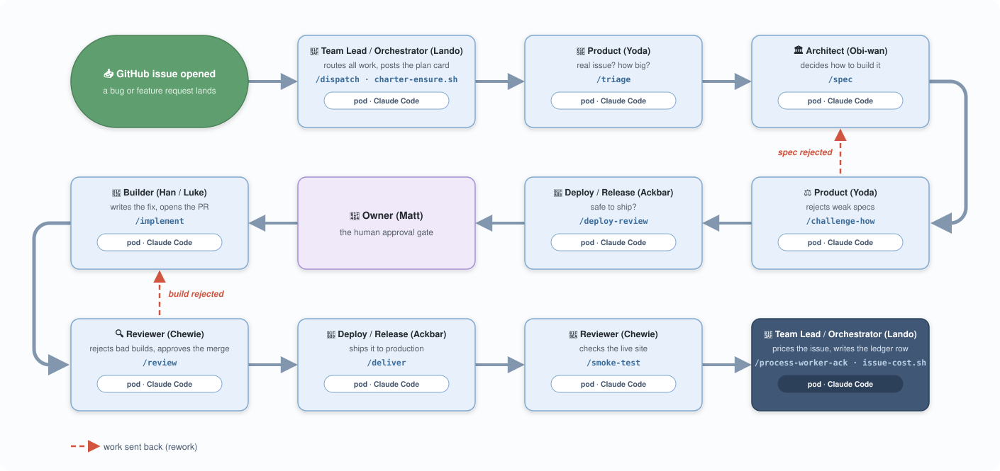

# Per-issue cost tracking for an AI dev team

*Origin take-home assessment, Matt Voget*

I run a team of eight AI coding agents (the "Falcon Dev Team") that works
GitHub issues end to end: triage, design, build, review, deploy. It runs on
[Kyber](docs/kyber-explainer.md), a platform I built for hosting long-running
AI agents. The team ships real software using shared credentials on a Claude Max
subscription. The question I wanted to answer: **how much would issues cost
using straight API rates?**

Kyber itself is not the small, scoped project the assignment asks for. It is
a passion project I've been hacking on since April, and I'd be happy to talk
through why I built it and how it works in the technical interview. In the
meantime, the [Kyber docs](https://github.com/matty-v/kyber/tree/main/docs)
cover the platform. The assignment's scope is the layer on top: optimizing my
team of agents running on the platform. What I'm personally interested in
answering is whether we can build a fully autonomous fleet of AI agents for
software development, and exploring where the limitations might be. Engineers
who can harness workflows coordinating multiple agents at a time have
something very powerful, especially as the LLMs become smarter and agent
harnesses like Claude Code become more sophisticated.

## How my AI team works an issue

Each box below shows a pod that runs on a Kubernetes cluster in my Kyber
platform. Each pod runs a Claude Code session with different skills for
performing every step of the software development lifecycle for a project.
Lando (the team lead) receives every GitHub event and routes each
handoff using webhooks to dispatch prompts to the other agents.

Before this assignment, agents were performing their roles but never
tracking costs, i.e. tokens on a given model. After this assignment, they now
run [`token-usage.sh`](docs/mirror/token-usage.sh) twice per stage: once at
pickup (an odometer reading of its session) and once at completion (posting
what its stage used and on which model). At the end, Lando adds it all up
with [`issue-cost.sh`](docs/mirror/issue-cost.sh) to show me a final number.

### The mechanics

An agent's skills are markdown instruction files loaded into its Claude
Code session. `handle-inbound`, for example, is the skill every worker
follows when Lando hands it a piece of work. The shell scripts are not
skills; they are ordinary tested programs that a skill tells the agent to
run at set points. The `handle-inbound` skill runs `token-usage.sh` at
pickup and again at completion, and Lando's close-out skill runs
`issue-cost.sh`. The skill decides when and why; the script owns the
numbers. That split is deliberate: a repeated lesson of this project is
that agents execute instructions that ARE a command far more reliably than
instructions that describe a procedure ([PROCESS.md](PROCESS.md) records
prose steps being skipped while script invocations ran 8 for 8).
Concretely:

- The scripts live in the team's shared repo (`falcon-dev-common`). Each
  agent's own repo carries an exact copy, pinned to a specific version, and
  the copy is linked into the agent's skills folder when its session
  starts. The whole fleet runs the same reviewed version, and that
  version's ID is stamped into every usage report.
- [`token-usage.sh`](docs/mirror/token-usage.sh) runs inside the pod and
  reads the log of the agent's own session, adding up the tokens used per
  model and counting each message exactly once. At pickup it records the
  starting count; at completion it computes what the stage used and embeds
  the result as a marker inside the GitHub comment the agent already
  posts. The marker is invisible when reading the comment on GitHub but
  easy for a program to find later, so the issue itself carries all the
  cost data and no new infrastructure was needed.
- At issue close, Lando's [`issue-cost.sh`](docs/mirror/issue-cost.sh)
  collects every marker from the issue and the pull requests linked to it,
  converts tokens to dollars using a price table generated from a public
  pricing feed (no price anywhere in the pipeline is typed by hand), and
  appends one row to the ledger file. A scheduled job that runs every 15
  minutes ([`ledger-reconciler.sh`](docs/mirror/ledger-reconciler.sh))
  writes any row the close-out missed and retries rows that could not be
  priced.

## An Experiment in Model Cost versus Quality

Part of this assignment was to first add cost tracking. I had all the
agents in the dev team running Opus 5 models before, which was inefficient.
I hypothesized that I could get away with cheaper models on some agents with
the hope of keeping quality high. To orchestrate and execute this experiment
I ran another local Claude Code session on Fable 5. The job of this agent
was to help me set up the experiment, implement cost tracking across the AI
dev team, and measure and publish the results.

The test setup: keep Opus 5 only at the design stage and the code-review
gate, and run Sonnet 5 everywhere else. I compared 3 issues (on another
personal project, Snapdex, [snapdex.ai](https://snapdex.ai)) using the new
setup against the 4-issue baseline.

The result: costs came down by about a third.

As for quality, the team under the new model arrangement had more issues
getting kicked back at the design and code-review gates (Obi-wan and Chewie
running Opus 5), but that extra spend was offset by the savings from the
cheaper models doing the building. Full detail, including the predictions I
wrote down before running it:
[docs/experiments/cost-per-issue.md](docs/experiments/cost-per-issue.md).

| | Before (all premium model) | Prediction (written first) | Result |
|---|---|---|---|
| **Cost per issue** | $33.86 median | $21 to $24 | **$22.63, down 33%** |
| **Work volume** | 46M tokens median | unchanged, within 15% | 44M on comparable issues: unchanged |
| **Quality** | 6.9% of issue cost was redone work | stays flat | **18.3% redone, on all 3 test issues** |
| **Net** | | savings win if quality holds | Savings of about $11 per issue bought about $2.10 of added rework: 5 to 1 in favor, in this sample |

## Working with AI: wins and challenges

**The wins:**

- Clearly stating the problem and objectives up front. In my Fable session,
  it tracked multiple tasks in phases, starting with making the cost-tracking
  changes to the team and ending with building the presentation for this
  assignment.
- For the AI dev team, having Opus as the model during spec design and code
  review was the most efficient use of models. As long as the spec is solid,
  it has a downstream effect on ensuring what gets built meets the spec.
- Diligently capturing everything in documentation. Having this assignment
  documented at each phase meant that I could pivot the independent variable
  from initial context loading on agents to the LLM each agent used, without
  the Fable session drifting from the goal.
- The Fable session independently monitored the team's execution of GitHub
  issues, which allowed us to iterate on any problems with cost or token
  reporting or other team issues.

**The things AI got wrong:**

- The Fable session at first suggested decreasing the context each agent
  loads as a means to decrease cost. It wasn't wrong, but I made it compute
  the estimated savings, which turned out to be less than the prediction for
  changing the models on the agents (8–12% vs. about 35%).
- We went through a few iterations where some agents didn't report token use
  even after the Fable session applied the changes. Some trial and error is
  inevitable when working on a complicated workflow with non-deterministic
  LLMs, but it puts a premium on extra scrutiny during the planning phase.
- Related to the above, the Fable session both caught and introduced bugs
  along the way. A few examples:
  - It shipped a cost script that passed large data through environment
    variables and hit an operating-system limit in production; one of the
    dev team's own agents diagnosed the crash from inside its pod
    ([fix](docs/mirror/fdc-123.patch)).
  - Its first ledger safety-net job failed silently because errors went
    where nobody looked; the same incident that revealed the crash also
    revealed the bad error routing
    ([the job](docs/mirror/ledger-reconciler.sh)).
  - Its cost scripts initially shipped with an outdated price table that
    would have silently cut every cost figure roughly in half; the reviewer
    agents it ran against its own code caught that, along with 21 other
    confirmed findings, before merge.
  - Agents skipped written instructions for posting the per-issue plan card
    twice; moving the procedure into a script
    ([charter-ensure.sh](docs/mirror/charter-ensure.sh)) fixed it, 4 for 4
    afterward.

The full blow-by-blow, including every prompt and every course correction,
is in [PROCESS.md](PROCESS.md).

## Known limitations and rough edges

- **Small sample.** 4 baseline issues, 3 test issues. Medians and
  per-issue comparisons, not statistics. Two test issues also ran in
  fast-track mode (skipping my approval gates); the cleanest test issue did
  not, and it matched the results.
- **Some readings have gaps.** Agents sometimes restart mid-task, and 4 of
  the 65 work segments across the seven issues lost their "starting odometer
  reading." Those issues
  report a known-minimum cost instead of a total. The fix is designed but was
  held back by the code freeze during the experiment.
- **Lando's own cost is not counted.** The team lead never assigns work to
  itself, so its always-on background spending never lands on any issue.
- **The platform second-opinion check rarely ran.** The fix made it
  possible, but the close-out step that runs it kept getting skipped, and the
  fallback that writes the ledger doesn't do the comparison.
- **The plan cards list outdated models.** The team's model roster file
  wasn't updated when I upgraded the fleet. Every report flags the difference
  between planned and actual instead of hiding it.

## What I'd do with more time

- Run the second designed experiment: shrink the 140KB of team documentation
  every agent re-reads, prediction already registered
  ([details](docs/experiments/cost-per-issue.md), 8–12% savings).
- Give partial rows a proper minimum-cost figure instead of a footnote.
- Fix the mid-task restart gap so readings stop getting lost.
- Refactor agent skills to be more efficient.
- Teach Kyber itself to attribute cost per issue, so the platform and the
  team agree on one number.
